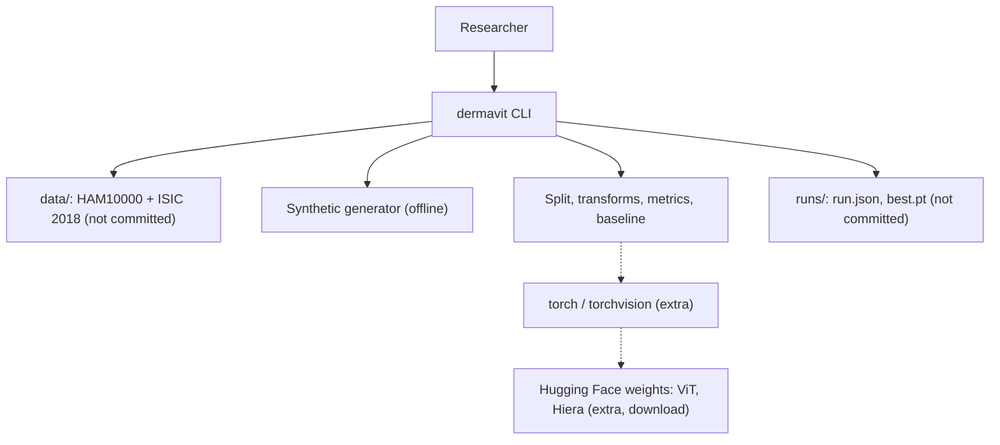
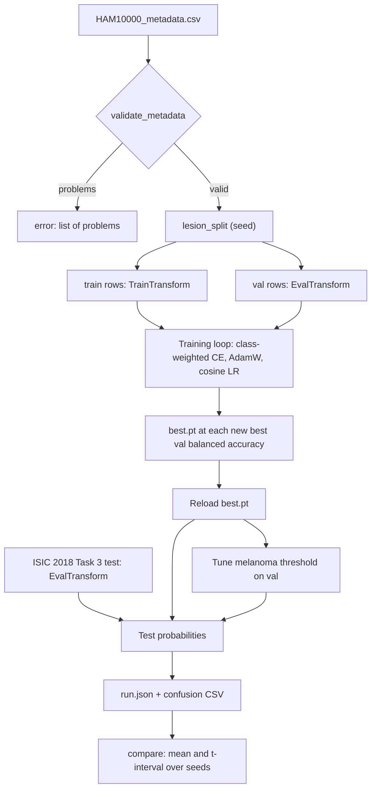

<div align="center">

# dermavit — A Leakage-Free ViT vs Hiera Benchmark for Skin-Lesion Classification

**dermavit is a research benchmark for engineers who compare vision models on dermatoscopic images. It takes HAM10000 and the ISIC 2018 test set through these steps to a fair, multi-seed comparison:**

`validate metadata` → `split by lesion` → `train with class weights` → `reload best checkpoint` → `evaluate with balanced metrics` → `compare over seeds`.


**[Summary](#1-summary)** ·
**[Workflow](#4-the-end-to-end-workflow)** ·
**[Run it](#15-how-to-run-dermavit)** ·
**[Configuration](#154-environment-variables)** ·
**[Known problems](#18-known-problems)** ·
**[Glossary](#20-glossary)**

</div>

> [!NOTE]
> This README uses ASD-STE100 Simplified Technical English. The writing rules and the project
> vocabulary are in [`docs/ste-style-guide.md`](docs/ste-style-guide.md). Each term in the
> [Glossary](#20-glossary) has only one meaning.

> [!WARNING]
> Do not use dermavit to diagnose a patient. It is a research benchmark, not a medical device.
> A dermatologist must review each case. HAM10000 contains mostly light skin types, so the scores do not transfer to all populations.

---

dermavit compares ViT-B/16 and Hiera-Base (and a CNN and a classical baseline) on the 7 HAM10000 classes.
The split keeps each lesion in one part, so near-duplicate images cannot inflate the validation score.
Each model uses the normalisation of its own pretraining, and only training images get random augmentation.
The report gives balanced accuracy, melanoma recall, ROC-AUC from probabilities and calibration, with intervals over seeds.

This README is the **one location that explains all of dermavit**. It gives these topics:

- the general design
- each component and its procedure, step by step
- the decision rules
- the data map
- the runbook
- the validation results and the known problems

| If you are… | Read |
|---|---|
| A manager or reviewer | [1](#1-summary), [3](#3-design-rules), [4](#4-the-end-to-end-workflow), [17](#17-validation-results), [19](#19-key-points) |
| A developer who joins the project | All sections, in sequence. Keep [15](#15-how-to-run-dermavit) and [18](#18-known-problems) open while you work |
| An operator who runs dermavit | [15](#15-how-to-run-dermavit), then the section for the component that you use |

---

## Table of contents

1. 🧭 [Summary](#1-summary)
2. 🏗️ [How dermavit is built](#2-how-dermavit-is-built)
   - 2.1 [Components](#21-components)
   - 2.2 [System context](#22-system-context)
   - 2.3 [Repository layout](#23-repository-layout)
3. 🛡️ [Design rules](#3-design-rules)
4. 🔄 [The end-to-end workflow](#4-the-end-to-end-workflow)
   - 4.1 [Full flow](#41-full-flow)
   - 4.2 [The life cycle of one run](#42-the-life-cycle-of-one-run)
5. 🔵 [The label map and the metadata](#5-the-label-map-and-the-metadata)
6. 🟢 [The lesion split](#6-the-lesion-split)
7. 🟣 [Transforms and model specs](#7-transforms-and-model-specs)
8. ⚖️ [Class imbalance and the melanoma threshold](#8-class-imbalance-and-the-melanoma-threshold)
9. 🧠 [The training loop](#9-the-training-loop)
10. 📏 [The metrics](#10-the-metrics)
11. 🧮 [The classical baseline](#11-the-classical-baseline)
12. 🔍 [Grad-CAM](#12-grad-cam)
13. 🖥️ [The CLI and the run files](#13-the-cli-and-the-run-files)
14. 🗂️ [Data and file map](#14-data-and-file-map)
15. ▶️ [How to run dermavit](#15-how-to-run-dermavit)
    - 15.1 [Prerequisites](#151-prerequisites) · 15.2 [Installation](#152-installation) · 15.3 [Run dermavit](#153-run-dermavit) · 15.4 [Environment variables](#154-environment-variables)
16. 🧩 [How to extend dermavit](#16-how-to-extend-dermavit)
17. ✅ [Validation results](#17-validation-results)
18. ⚠️ [Known problems](#18-known-problems)
19. 📌 [Key points](#19-key-points)
20. 📖 [Glossary](#20-glossary)
21. 📄 [License](#21-license)

---

## 1. Summary

**The problem.** A team wants to know if Hiera is cheaper than ViT at the same quality on skin-lesion images. These questions are difficult:

- How do you stop images of one lesion from appearing in train and validation?
- How do you compare two models when each was pretrained with other image statistics?
- Which metric shows a model that predicts "nevus" for most images?
- Which weights does the test use, and is the difference larger than the noise between seeds?

dermavit gives each of these questions its own component. Each component has tests that prove its rule.

| Item | Value |
|---|---|
| Input | HAM10000 metadata and images, ISIC 2018 Task 3 test images and ground truth, or SYNTHETIC data |
| Output | `run.json` for each model and seed, confusion matrix CSV files, a comparison table over seeds |
| Components | **12** core modules (labels, config, metadata, splits, images, synthetic, features, imbalance, metrics, baseline, reports, cli) and **3** torch modules (models, train, explain) |
| Models | `vit_b16`, `hiera_base` (Hugging Face), `efficientnet_b0` (torchvision), `tiny_cnn`, and the classical baseline |
| Offline mode | The baseline, the demo and all core tests. No download, no GPU, no torch |
| Safety | The split refuses a shared lesion. Validation and test have no random augmentation. The best checkpoint is reloaded |
| Tests | **40** unit tests (`pytest`). CI installs only `.[dev]`: **34** pass and 1 module of 6 tests skips (`torch` extra). With the `torch` extra: 40 pass |


---

## 2. How dermavit is built

### 2.1 Components

| Component | Module | Purpose |
|---|---|---|
| Label map | `src/dermavit/labels.py` | The single class order, display names, ISIC column map |
| Settings | `src/dermavit/config.py` | Environment variables and a local `.env` loader |
| Metadata | `src/dermavit/metadata.py` | Validate HAM10000 metadata, read the ISIC 2018 ground truth |
| Splits | `src/dermavit/splits.py` | Lesion-grouped stratified split, leakage check |
| Images | `src/dermavit/images.py` | Image sources, model specs, train and eval transforms |
| Synthetic data | `src/dermavit/synthetic.py` | Lesions with 1 to 4 near-duplicate images, HAM10000 class shares |
| Features | `src/dermavit/features.py` | 34 colour and texture features for the baseline |
| Imbalance | `src/dermavit/imbalance.py` | Class weights, sampler weights, melanoma threshold |
| Metrics | `src/dermavit/metrics.py` | Balanced accuracy, macro F1, recalls, AUC, ECE, intervals |
| Baseline | `src/dermavit/baseline.py` | Features + class-weighted logistic regression |
| Reports | `src/dermavit/reports.py` | Report files and the comparison over seeds |
| Models (torch) | `src/dermavit/models.py` | ViT, Hiera, EfficientNet and TinyCNN factory |
| Training (torch) | `src/dermavit/train.py` | Seeded loop, checkpoint reload, efficiency log |
| Grad-CAM (torch) | `src/dermavit/explain.py` | Heat maps for CNN models |
| CLI | `src/dermavit/cli.py` | The `dermavit` command with 7 subcommands |

### 2.2 System context



### 2.3 Repository layout

```
dermavit/
├── .github/workflows/ci.yml     # CI: Python 3.11, pip install -e ".[dev]", pytest -q
├── .env.example                 # the 5 environment variable names, no values
├── pyproject.toml               # core deps, extras torch, hf, dev, dermavit script
├── data/README.md               # sources, licenses, layout and download steps
├── docs/ste-style-guide.md      # writing rules and project vocabulary
├── src/dermavit/
│   ├── labels.py  config.py  metadata.py  splits.py
│   ├── images.py  synthetic.py  features.py
│   ├── imbalance.py  metrics.py  baseline.py  reports.py
│   ├── models.py  train.py  explain.py      # torch only, imported on demand
│   └── cli.py
└── tests/                                    # 40 tests, synthetic data only
```

---

## 3. Design rules

### 3.1 One lesion, one split
`lesion_split` uses `StratifiedGroupKFold` with `lesion_id` as the group. `assert_no_lesion_overlap` raises `LeakageError` if a lesion is in two splits. The ISIC 2018 Task 3 images are the external test set, and no fit uses them.

### 3.2 One label map
`labels.CLASSES` fixes the class order. The encoder, the model heads, the confusion matrix labels and the ISIC column map all read it.

### 3.3 Deterministic evaluation
`EvalTransform` only resizes and normalises. `TrainTransform` adds flips, rotations, a crop and brightness jitter, and only the training dataset uses it.

### 3.4 Each model has its own normalisation
`MODEL_SPECS` gives the mean and standard deviation of each pretraining: 0.5 for ViT in21k, ImageNet statistics for Hiera and EfficientNet.

### 3.5 The test uses the best checkpoint
The training loop saves `best.pt` at each new best validation balanced accuracy. After the last epoch it loads `best.pt` again, and only then it evaluates validation and test.

### 3.6 Imbalance is visible and handled
The headline metric is balanced accuracy. Melanoma recall is in each report. The loss uses class weights (or a balanced sampler), and a melanoma threshold is tuned on validation.

### 3.7 Problems of the earlier prototype and their fixes

| # | Problem in the earlier prototype | Fix in dermavit | Test |
|---|---|---|---|
| 1 | Image-level split, so images of one lesion in train and validation | Lesion-grouped stratified split and a leakage check | `test_lesion_split_has_no_shared_lesion` |
| 2 | Random augmentation on validation and test | Separate deterministic `EvalTransform` | `test_eval_transform_is_deterministic` |
| 3 | Confusion matrix labels in another order than the label map | One label map for all outputs | `test_confusion_matrix_uses_the_label_order` |
| 4 | ROC from hard 7-class predictions | One-vs-rest AUC from probabilities | `test_auc_comes_from_probabilities_not_hard_labels` |
| 5 | Best checkpoint saved but not reloaded for the test | Reload `best.pt` before evaluation | `test_training_reloads_the_best_checkpoint` |
| 6 | Accuracy and weighted metrics hide the 67 % nevus share | Balanced accuracy, macro F1, melanoma recall, class weights, melanoma threshold | `test_always_nevus_has_high_accuracy_but_low_balanced_accuracy` |
| 7 | Mean and std 0.5 for Hiera | Model-specific normalisation | `test_each_model_uses_its_own_normalisation` |
| 8 | Memory after validation, no time for the stop epoch | Peak memory for each epoch, each epoch logged before the stop | `test_every_epoch_is_logged_with_time` |
| 9 | Undefined names, missing folders, duplicate functions | Packaged code, folders made by the code, CLI tests | `test_cli_round_trip` |
| 10 | One run, no seeds | Seeds for all random sources, t-intervals over seeds, lesion bootstrap | `test_training_is_reproducible`, `test_seed_summary_t_interval` |

---

## 4. The end-to-end workflow

### 4.1 Full flow



### 4.2 The life cycle of one run

1. The CLI reads and validates the metadata and the test ground truth.
2. `lesion_split` divides the lesions into `train` and `val` with the run seed.
3. `set_seed` fixes `random`, numpy, torch and the data order.
4. Each epoch trains, measures time and peak memory, and evaluates validation balanced accuracy.
5. A new best score saves `best.pt`. After `patience` epochs without a gain, the loop stops.
6. The loop loads `best.pt` again and predicts validation and test probabilities.
7. The run tunes the melanoma threshold on validation and applies it to test.
8. The run writes `runs/<model>/seed<k>/run.json`.

---

## 5. The label map and the metadata

**Purpose.** Give one class order and stop bad metadata before a split.

| Index | Class | Name |
|---|---|---|
| 0 | `akiec` | Actinic keratosis / intraepithelial carcinoma |
| 1 | `bcc` | Basal cell carcinoma |
| 2 | `bkl` | Benign keratosis-like lesion |
| 3 | `df` | Dermatofibroma |
| 4 | `mel` | Melanoma |
| 5 | `nv` | Melanocytic nevus |
| 6 | `vasc` | Vascular lesion |

**Rules**

- The columns `lesion_id`, `image_id`, `dx`, `dx_type`, `age`, `sex` and `localization` must exist.
- `dx` must be a class of the label map. `dx_type` must be `histo`, `follow_up`, `consensus` or `confocal`.
- `age` must be 0 to 120 or empty. An empty `sex` becomes `unknown`.
- Each `image_id` occurs once. Each lesion has exactly one `dx`.
- The ISIC 2018 ground truth must have the 7 one-hot columns, and each row must have exactly one 1.

---

## 6. The lesion split

**Purpose.** Measure the model on lesions that it did not see.

**Procedure**

1. Set the fold count to round(1 / `val_fraction`). The default fraction 0.2 gives 5 folds.
2. Run `StratifiedGroupKFold` with `dx` as the target and `lesion_id` as the group, shuffled with the seed.
3. Use the first test fold as `val`. All other rows are `train`.
4. Check that no lesion is in both parts.

**Rules**

- `image_split` exists only to measure leakage. The CLI uses it only with `baseline --split-mode image`.
- A class with fewer lesions than folds gives a scikit-learn warning. The split is still grouped.

---

## 7. Transforms and model specs

**Purpose.** Give each model its correct input, and keep evaluation deterministic.

| Model | Source | Weights | Size | Mean | Std |
|---|---|---|---|---|---|
| `vit_b16` | Hugging Face | `google/vit-base-patch16-224-in21k` | 224 | 0.5, 0.5, 0.5 | 0.5, 0.5, 0.5 |
| `hiera_base` | Hugging Face | `facebook/hiera-base-224-in1k-hf` | 224 | 0.485, 0.456, 0.406 | 0.229, 0.224, 0.225 |
| `efficientnet_b0` | torchvision | `IMAGENET1K_V1` | 224 | 0.485, 0.456, 0.406 | 0.229, 0.224, 0.225 |
| `tiny_cnn` | local | random init | 64 | 0.485, 0.456, 0.406 | 0.229, 0.224, 0.225 |

| Transform | Steps | Used for |
|---|---|---|
| `TrainTransform` | Random crop 80–100 %, horizontal and vertical flip, rotation by 0/90/180/270, brightness ±10 %, resize, normalise | Training images |
| `EvalTransform` | Resize, normalise | Validation and test images |

**Rules**

- The train transform takes a numpy generator seeded with (seed, epoch, image index). Two runs with one seed see the same augmentation.
- `normalisation_from_processor` reads the statistics from a Hugging Face image processor, to check the table above.

---

## 8. Class imbalance and the melanoma threshold

**Purpose.** Stop the majority class from controlling the model and the score.

| Item | Rule |
|---|---|
| Class weights `inverse` | n / (k × count), then scaled to mean 1 over the present classes |
| Class weights `effective` | (1 − β) / (1 − β^count), β = 0.999, scaled to mean 1 |
| Sampler weights | The class weight of each sample, for `WeightedRandomSampler` |
| `--weighting` | `loss` (default, weighted cross-entropy), `sampler` or `none` |

**Procedure (melanoma threshold)**

1. Take P(mel) of the validation images whose class is `mel`.
2. Select the highest threshold that gives a melanoma recall of `target_recall` (default 0.9) or more.
3. On test, predict `mel` if P(mel) ≥ threshold. Otherwise predict the most probable other class.
4. Report the test metrics with and without the threshold.

---

## 9. The training loop

**Purpose.** Train each model in the same, recorded way.

| Setting | Default |
|---|---|
| Optimiser | AdamW, learning rate 1e-4, weight decay 0.05 |
| Schedule | Cosine annealing over `--epochs` (10) |
| Early stop | `--patience` 3 epochs without a gain in validation balanced accuracy |
| Batch size | 32, the same for each model |
| Mixed precision | On for CUDA, off on CPU |
| Seeds | `--seeds 0,1,2` (one run for each seed) |

| Recorded for each epoch | Recorded for each run |
|---|---|
| Train loss, validation balanced accuracy, best flag | Parameters, device, AMP flag, batch size, image size |
| Train seconds, epoch seconds (train plus validation), train images per second | Maximum peak memory, mean throughput, epochs run, total seconds |
| Peak GPU memory (`torch.cuda.max_memory_allocated`, reset at the start of the epoch) | Test images per second |


---

## 10. The metrics

| Metric | Definition | Note |
|---|---|---|
| Balanced accuracy | Mean recall over the classes in the true labels | The ISIC 2018 Task 3 metric. Headline |
| Macro F1 | Mean F1 over the classes in the true labels | |
| Recall for each class | Share of each class that the model finds | `melanoma_recall` is separate |
| ROC-AUC (one-vs-rest) | AUC of P(class) for each class with positives and negatives, and the macro mean | From probabilities only |
| ECE | Expected calibration error, 15 bins of the top probability | Lower is better |
| Lesion bootstrap interval | 95 % percentile interval of balanced accuracy, 500 resamples of lesions | Validation reports |
| Seed interval | Mean and 95 % t-interval over the seeds | `compare` and the CLI summaries |

**Rules**

- Each probability row must have 7 non-negative values that sum to 1.
- Plain accuracy is in the report, but no decision uses it.

---

## 11. The classical baseline

**Purpose.** Give a floor for the deep models, and run the full pipeline without torch.

**Procedure**

1. Calculate 34 features for each image. The features are colour moments, a hue histogram, centre contrast and texture statistics.
2. Split by lesion (or by image, for the leakage measurement).
3. Fit `StandardScaler` and `LogisticRegression(class_weight="balanced")` on the training rows.
4. Predict probabilities for validation and test. Fill classes that are absent in training with 0.
5. Tune the melanoma threshold on validation. Report validation, test and thresholded test.

---

## 12. Grad-CAM

**Purpose.** Show which image region drives a CNN prediction.

**Procedure**

1. Register hooks on `model.cam_layer` (or a given layer).
2. Run the image forward. Back-propagate the logit of the predicted class (or a given class).
3. Weight each activation map by the mean of its gradient. Sum, apply ReLU and resize to the input size.
4. Scale the map to [0, 1].

**Rules**

- `grad_cam` accepts one image (shape 1 × 3 × H × W).
- For ViT and Hiera, use attention rollout. This is a planned milestone.

---

## 13. The CLI and the run files

| Command | What it does |
|---|---|
| `dermavit synth [--out D] [--lesions N] [--size S] [--test-images N] [--seed S]` | Write a SYNTHETIC data folder in the HAM10000 layout |
| `dermavit validate METADATA` | Check the metadata and count multi-image lesions |
| `dermavit split METADATA [--out F] [--val-fraction F] [--seed S]` | Write a lesion-grouped split CSV |
| `dermavit baseline [--data D] [--split-mode lesion\|image] [--seeds L] [--target-recall R] [--out D]` | Baseline over seeds, with run files |
| `dermavit train [--data D] --model M [--seeds L] [--epochs N] [--batch-size N] [--lr F] [--patience N] [--weighting W] [--image-size S] [--no-pretrained] [--out D]` | Train a deep model over seeds (torch) |
| `dermavit compare [--runs D] [--part val\|test\|test_thresholded]` | Mean and t-interval for each model over seeds |
| `dermavit demo` | Offline demo: image split against lesion split on SYNTHETIC data |

**Rules**

- A `ConfigError`, `MetadataError`, `FileNotFoundError`, `KeyError`, `ValueError` or `ImportError` prints `error: <message>`, and the exit code is 1.
- Each run writes `runs/<model>/seed<k>/run.json`. Training also writes `best.pt`, and the baseline writes `test.json` and `test_confusion.csv`.

---

## 14. Data and file map

| Path | Committed? | Contents |
|---|---|---|
| `data/README.md` | Yes | Sources, licenses, layout, download steps |
| `data/HAM10000_metadata.csv`, `data/images/` | No (git ignores them) | HAM10000, CC BY-NC 4.0 |
| `data/ISIC2018_Task3_Test_Images/`, `data/ISIC2018_Task3_Test_GroundTruth.csv` | No (git ignores them) | External test set |
| `data/synthetic/` | No (git ignores it) | Output of `dermavit synth` |
| `runs/<model>/seed<k>/run.json`, `best.pt` | No (git ignores them) | Run reports and checkpoints |
| `.env.example` | Yes | 5 variable names, no values |

---

## 15. How to run dermavit

### 15.1 Prerequisites

| Need | For |
|---|---|
| Python 3.11+ | All components |
| `numpy`, `pandas`, `scikit-learn`, `scipy`, `pillow` | The core (installed with the package) |
| Extra `torch` (`torch`, `torchvision`) | `tiny_cnn`, `efficientnet_b0`, training, Grad-CAM |
| Extra `hf` (adds `transformers`) | `vit_b16`, `hiera_base` |
| A CUDA GPU | Practical training of ViT and Hiera on 10,015 images |

### 15.2 Installation

```bash
git clone https://github.com/KrishnaAnnavaram/dermavit.git
cd dermavit
python -m venv .venv
. .venv/bin/activate            # Windows: .venv\Scripts\activate
pip install -e ".[dev]"
pip install -e ".[hf]"          # optional: torch, torchvision, transformers
```

### 15.3 Run dermavit

Offline:

```bash
dermavit demo
dermavit synth --out data/synthetic
dermavit baseline --data data/synthetic --seeds 0,1,2
dermavit train --data data/synthetic --model tiny_cnn --no-pretrained --image-size 48 --epochs 12 --lr 0.003
dermavit compare --runs runs
```

With the real data in `data/` (see [`data/README.md`](data/README.md)):

```bash
dermavit validate data/HAM10000_metadata.csv
dermavit baseline --seeds 0,1,2
dermavit train --model vit_b16 --seeds 0,1,2
dermavit train --model hiera_base --seeds 0,1,2
dermavit train --model efficientnet_b0 --seeds 0,1,2
dermavit compare --runs runs --part test
```

### 15.4 Environment variables

| Variable | Used by | Meaning |
|---|---|---|
| `DERMAVIT_DATA_DIR` | CLI | Data folder. Default `data` |
| `DERMAVIT_OUTPUT_DIR` | Settings | Output folder name. Default `runs` (the CLI `--out` overrides it) |
| `DERMAVIT_SEED` | `split` | Default seed. Default 42 |
| `DERMAVIT_DEVICE` | `train` | `auto` (default), `cpu`, `cuda` or `mps` |
| `HF_HOME` | transformers | Cache folder for the downloaded weights |

dermavit uses no credentials. Keep local settings in `.env`. Git ignores this file.

---

## 16. How to extend dermavit

| You want to… | Do this | Code change? |
|---|---|---|
| Add a backbone (for example ConvNeXt) | Add a `ModelSpec` and a branch in `models.build_model` | Small |
| Change the augmentation | Edit `TrainTransform` | Small |
| Use a sampler instead of a weighted loss | `--weighting sampler` | No |
| Change the melanoma target | `--target-recall 0.95` | No |
| Add a metric | Add it to `classification_report` and `reports.METRICS` | Small |
| Use another data set with lesion ids | Write the same metadata columns and folder layout | No |

Planned milestones (not built):

- **M6:** attention rollout for ViT and Hiera.
- **M7:** FLOPs for each model, and a fixed-batch throughput benchmark.
- **M8:** temperature scaling for calibration.

---

## 17. Validation results

| Validation | Result | Command |
|---|---|---|
| Unit tests (CI installs only `.[dev]`) | **34 passed, 1 skipped** (the torch module of 6 tests) | `pytest -q` |
| Unit tests with the `torch` extra | **40 passed** | `pytest -q` |

**SYNTHETIC demo** (600 lesions, 1,287 images, 150 external test images, baseline, 5 seeds, mean and 95 % t-interval):

| Split | Validation balanced accuracy | Test balanced accuracy | Test melanoma recall | Test melanoma recall with threshold |
|---|---|---|---|---|
| By image (leaks) | **0.930** (0.868–0.992) | 0.740 (0.738–0.741) | 0.941 | 0.871 |
| By lesion | **0.715** (0.649–0.781) | 0.721 (0.673–0.770) | 0.941 | 0.894 |

The image split gives a validation score 0.19 higher than its test score. The lesion split gives a validation score close to the test score. This is the leakage of problem 1 in section 3.7, measured.

**SYNTHETIC folder run** (`synth` defaults, 3 seeds, CPU, `tiny_cnn` from random weights, 12 epochs maximum, patience 4):

| Model | Test balanced accuracy (95 % CI) | Test macro AUC | Test ECE | Train images/s (CPU) |
|---|---|---|---|---|
| Baseline (lesion split) | **0.735** (0.634–0.836) | 0.969 | 0.065 | n/a |
| `tiny_cnn` | 0.476 (0.403–0.549) | 0.899 | 0.222 | 321 |

The 3 `tiny_cnn` runs took 88 s in total. They stopped early (best epochs 0 to 3), and they are poorly calibrated.

These numbers come from SYNTHETIC data. They prove that the split, the metrics, the threshold, the checkpoint reload and the seed summary work. They are not skin-lesion results.
dermavit did not train ViT or Hiera on HAM10000 here, so this README gives no ViT or Hiera score.

---

## 18. Known problems

Read these problems before you use dermavit results.

| # | Area | Problem | Impact and action |
|---|---|---|---|
| 1 | Real results | No ViT, Hiera or EfficientNet run on HAM10000 is in this repository | Run `dermavit train` on a GPU and report the run files |
| 2 | Medical use | The benchmark is not a medical device and was not clinically validated | Do not diagnose with it. A dermatologist must review each case |
| 3 | Data bias | HAM10000 contains mostly light skin types from two centres | Do not expect the same scores on other populations |
| 4 | ViT and Hiera explanations | Grad-CAM supports CNN models only | Attention rollout is planned (M6) |
| 5 | Efficiency | Peak memory is measured on CUDA only. FLOPs are not measured | Compare memory on the same GPU, batch size and precision |
| 6 | Rare classes | `df` and `vasc` have about 1 % of the images. Their recall changes much between seeds | Read the per-class recall and the seed interval |
| 7 | Threshold | The melanoma threshold comes from a small validation set | Check it on a separate calibration set before you use it |
| 8 | Split warning | A class with fewer lesions than folds gives a scikit-learn warning | The split stays grouped. Use more lesions or fewer folds |
| 9 | CI | CI does not run the torch tests | Run `pytest` with the `torch` extra before a release |

---

## 19. Key points

1. **One lesion is in one split.** On synthetic data, the image split overstated the validation score by 0.19.
2. **Evaluation is deterministic.** Only training images get random augmentation.
3. **Each model gets its own normalisation.** ViT uses 0.5. Hiera and EfficientNet use ImageNet statistics.
4. **The test uses the best checkpoint.** The loop reloads `best.pt` before evaluation.
5. **Balanced accuracy and melanoma recall come first.** A model that always says "nevus" scores 0.25 balanced accuracy.
6. **Seeds and intervals are standard.** Each comparison gives a mean and a t-interval over seeds.
7. **This is research code.** It is not a diagnosis tool, and human review is necessary.

---

## 20. Glossary

| Term | Meaning |
|---|---|
| **Balanced accuracy** | The mean of the recall of each class |
| **Baseline** | Handcrafted features plus class-weighted logistic regression |
| **Checkpoint** | The weights of the best epoch, `best.pt` |
| **Class** | One diagnosis in `labels.CLASSES` |
| **ECE** | Expected calibration error |
| **Eval transform** | The deterministic resize and normalisation for validation and test images |
| **External test set** | The ISIC 2018 Task 3 test images and ground truth |
| **Image** | One dermatoscopic picture, named by `image_id` |
| **Label map** | The class order in `labels.py` |
| **Leakage** | Images of one lesion in more than one split |
| **Lesion** | One skin lesion, named by `lesion_id` |
| **Melanoma threshold** | The P(mel) value above which the prediction is melanoma |
| **Model spec** | The weights, image size and normalisation of one model |
| **Run** | One training of one model with one seed |
| **Split** | The `train` or `val` part of the HAM10000 metadata |
| **Synthetic data** | Data that `synthetic.py` makes |
| **Train transform** | The random augmentation for training images |

---

## 21. License

[MIT](LICENSE) © 2026 Krishna Annavaram
